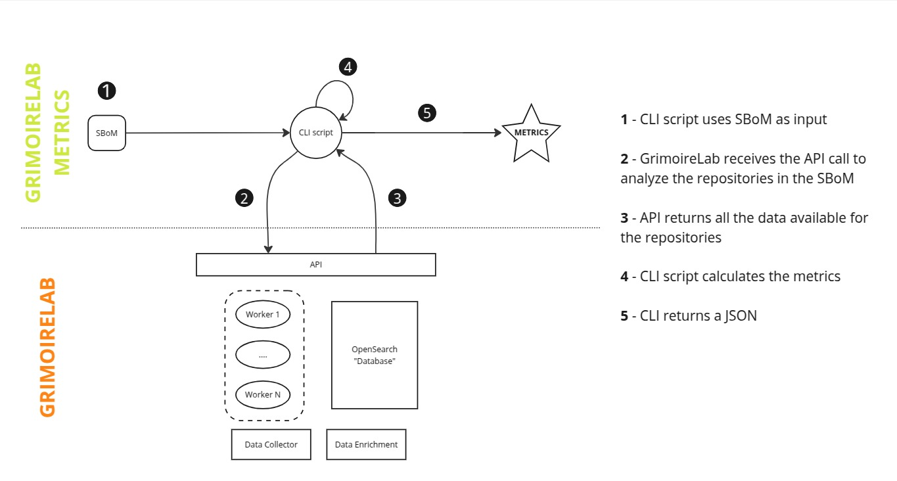

# grimoirelab-metrics

Client to generate GrimoireLab metrics for Project Health using the
software analytics platform [GrimoireLab](https://github.com/chaoss/grimoirelab).



## Installation

### Prerequisites

Instances of GrimoireLab 2.x and OpenSearch must be running before launching this tool.
Please check the [GrimoireLab](https://github.com/chaoss/grimoirelab/blob/2.x/README.md)
documentation in order to deploy the platform.

To get this tool running, we also recommend using [poetry](https://python-poetry.org/).
This package manager will install the tool and all its dependencies.
You can install `poetry` by following [this guide](https://python-poetry.org/docs/#installing-with-pipx).

Once you have `poetry` running, move to the next section.

### Steps

1. Clone the repository:

    ```bash
    git clone git@github.com:Bitergia/grimoirelab-metrics.git
    cd grimoirelab_metrics
    ```

2. Install dependencies and tool:

    ```bash
    poetry update
    poetry install
    ```

    This will install the tool inside of a virtual environment managed by
    poetry. To use the tool you will have to activate it first with the
    command `eval $(poetry env activate)` (poetry >= 2.x) or
    `poetry shell` (poetry < 2.x).

    For development mode, install the tool with: `poetry install --with dev`

## Usage

Given a SPDX SBOM file with git repositories as input, this tool will generate
a set of Project Health metrics. These metrics are calculated using the data
stored on GrimoireLab about those repositories. If any of the repositories
is not available on GrimoireLab, the tool will add it to GrimoireLab to have
it analyzed.

```bash
grimoirelab-metrics spdx.xml \
  --grimoirelab-url http://localhost:8000 \
  --grimoirelab-user user --grimoirelab-password password \
  --opensearch-url https://127.0.0.1:9200 \
  --opensearch-index events \
  --opensearch-user 'admin' --opensearch-password 'admin' \
  --verify-certs --opensearch-ca-certs /path/to/ca.pem \
  --from-date 2024-01-01 --to-date 2025-01-01 \
  --repository-timeout 3600 \
  --code-file-pattern "\.py$|\.js$" \
  --binary-file-pattern "\.exe$|\.tar$" \
  --pony-threshold 0.5 \
  --elephant-threshold 0.5 \
  --dev-categories-thresholds 0.8 0.95 \
  --output metrics.json
```

The parameters needed to run the tool are:

- A valid SPDX file
- GrimoireLab instance address
- OpenSearch instance address
- OpenSearch index name, where GrimoireLab events data are stored
- Output filename, where metrics will be written.

This is an example of a valid SPDX file:

```xml
<?xml version="1.0" encoding="utf-8"?>
<Document>
    <SPDXID>SPDXRef-DOCUMENT</SPDXID>
    <creationInfo>
        <created>2025-02-07T00:00:01Z</created>
        <creators>Organization: Bitergia</creators>
    </creationInfo>
    <dataLicense>CC0-1.0</dataLicense>
    <name>GrimoireLab</name>
    <spdxVersion>SPDX-2.3</spdxVersion>
    <documentNamespace>mynamespace</documentNamespace>
    <packages>
        <SPDXID>SPDXRef-bootstrap-gnu-config.bst-0</SPDXID>
        <comment>Product: gnu-config</comment>
        <downloadLocation>https://github.com/chaoss/grimoirelab-perceval.git</downloadLocation>
        <filesAnalyzed>false</filesAnalyzed>
        <name>bootstrap/gnu-config.bst</name>
        <sourceInfo>git</sourceInfo>
    </packages>
    <packages>
        <SPDXID>SPDXRef-bootstrap-gnu-config.bst-0</SPDXID>
        <comment>Product: gnu-config</comment>
        <downloadLocation>https://github.com/chaoss/grimoirelab-core.git</downloadLocation>
        <filesAnalyzed>false</filesAnalyzed>
        <name>bootstrap/gnu-config.bst</name>
        <sourceInfo>git</sourceInfo>
    </packages>
</Document>
```

## Project Health Metrics

This is the list of the metrics generated by this tool:

### Pony factor

The metric is defined as the number of individuals, who produce up to the
first 50% of the total number of code contributions (in descending order)
within a given time period.

A low Pony Factor implies a high dependency on these individuals, making the
project vulnerable if they were to leave.

*Also known as: Lottery Factor, Bus Factor, Contributor Absence Factor.*

CHAOSS definition of the [Contributor Abscence Factor](https://www.chaoss.community/kb/metric-contributor-absence-factor/).

### Elephant factor

The metric is defined as the number of unique organizations producing up to the
first 50% of the total number of code contributions (in descending order)
within a given time period.

It was first defined by Bitergia, and it applies the concept of the
Pony Factor metric and takes it to contributing Organizations.

Contributions are focused on Git commits, and the organization
is determined by the email address of the commit author.

CHAOSS definition of the [Elephant Factor](https://www.chaoss.community/kb/metric-elephant-factor/).

### Number of contributing organizations

This metric quantifies the total number of distinct organizations whose members
have made contributions to an open source project over a specified period.

Contributions are focused on Git commits, and the organization
is determined by the email address of the commit author.

CHAOSS definition of the [Organizational Diversity](https://www.chaoss.community/kb/metric-organizational-diversity/).

### Number of organizations contributing recently

This metric quantifies the number of unique organizations whose members have
actively made contributions to an open source project within the last 90 days.

Contributions are focused on Git commits, and the organization
is determined by the email address of the commit author.

CHAOSS definition of the [Organizational Diversity](https://www.chaoss.community/kb/metric-organizational-diversity/)
filtered by a specific timeframe.

### Number of recent contributors

This metric quantifies the total count of unique individuals who contributed
within the last 90 days.

CHAOSS definition of [Contributors](https://www.chaoss.community/kb/metric-contributors/) filtered by a
specific timeframe.


### Number of recent commits

This metric counts the total number of commits made to the project within the
last 90 days.

CHAOSS definition of [Code Changes Commits](https://www.chaoss.community/kb/metric-code-changes-commits/) filtered by
the last 90 days.

### Contributor Growth Rate

This metric measures the growth rate of active contributors, defined as the
number of people sending one or more code contributions (in this case,
Git commits) in a given period.

To calculate it, the period is split into two halves, and the number of active
contributors in each half is compared. The growth rate is the difference
between the second half and the first half, divided by the number of active
contributors in the first half.

```math
GrowthRate (t_1, t_2) = \frac{C_a(t_2) - C_a(t_1)}{C_a(t_1)}
```

### Contributor Growth

This metric measures the growth of active contributors, defined as the
number of people sending one or more code contributions (in this case,
Git commits) in a given period.

To calculate it, the period is split into two halves, and the number of active
contributors in each half is compared. Growth is the difference between the
second half and the first half.

```math
Growth (t_1, t_2) = C_a(t_2) - C_a(t_1)
```

### Number of active branches

This metric refers to the count of branches within a project's version control
repository (for this case, Git) that have seen recent development activity,
usually indicated by new commits.

CHAOSS definition of [Branch Lifecycle](https://www.chaoss.community/kb/metric-branch-lifecycle/).

### Days since last commit

This metric shows the number of days since the last commit was submitted to the
repository or the project.

CHAOSS definition of [Code Changes Commits](https://www.chaoss.community/kb/metric-code-changes-commits/) 
taking into account the last commit activity.

### Presence of an adopters file in a standard location

This metric verifies the existence of a file containing the full text of
the project's adopters.

Standard practice dictates that this file is named `ADOPTERS`, `ADOPTERS.md`,
or `ADOPTERS.txt`, and is located in the root directory of the project's
source code repository.

### Presence of a license file in a standard location

This metric verifies the existence of a file containing the full text of
the project's chosen open source license.

Standard practice dictates that this file is named `LICENSE`, `LICENSE.md`,
`LICENSE.txt`, or `COPYING` (a convention historically used by GNU projects)
and is located in the root directory of the project's source code repository.

CHAOSS definition of [License Declared](https://www.chaoss.community/kb/metric-licenses-declared/).

### Rate of contributors contributing infrequently vs. regularly

This metric involves categorizing contributors based on the frequency,
consistency, and intensity of their contributions over a defined period. It aims
to distinguish between individuals who contribute episodically
(infrequent contributors) and those who engage with the project consistently
and often substantially (regular or core contributors).

The CHAOSS community, for instance, defines
"[Occasional Contributors](https://www.chaoss.community/kb/metric-occasional-contributors/)" as
"people who make contributions to a project on an irregular basis".

### Number of contributors who have contributed in previous periods

This metric, often referred to as "returning contributors" or as an indicator
of "contributor retention," counts the number of unique individuals who were
active contributors in the last 90 days and had also made contributions in one
or more defined previous periods.

### Rate of commits over specified periods

This metrics calculates the rate of commits between the last 90 days and
the last year. The purpose of this metrics is having an estimation of how
distributed contributions are, and the "momentum" of the project.

### Number of commits per repository

Activity for each of the Git repositories analyzed.

CHAOSS definition of [Code Changes Commits](https://www.chaoss.community/kb/metric-code-changes-commits/) filtered
by repository.

### Number of developers per repository

Unique participants producing commits in a given repository.

CHAOSS definition of [Contributors](https://www.chaoss.community/kb/metric-contributors/) filtered
by repository.

### File type metrics (code, documentation, or others)

Type of activity done by developers, mainly split into code, documentation, and others.

### Commit size metrics (added and removed lines)

This provides an overview of the usual size of the code review processes and good practices
when submitting code.

CHAOSS uses the metric [Change Request Commits](https://www.chaoss.community/kb/metric-change-request-commits/)
as a way to use this as a filter.

### Message size metrics (total, mean, and median)

This metrics provides information about how extensive a developer is providing information about the
change in the commit.

### Frequency metrics for commits

This allows to understand the consistency of developers when producing code.

### Developer categories (core, regular and casual)

This metric structures the developers by their activity and consistency. The core developers produce
