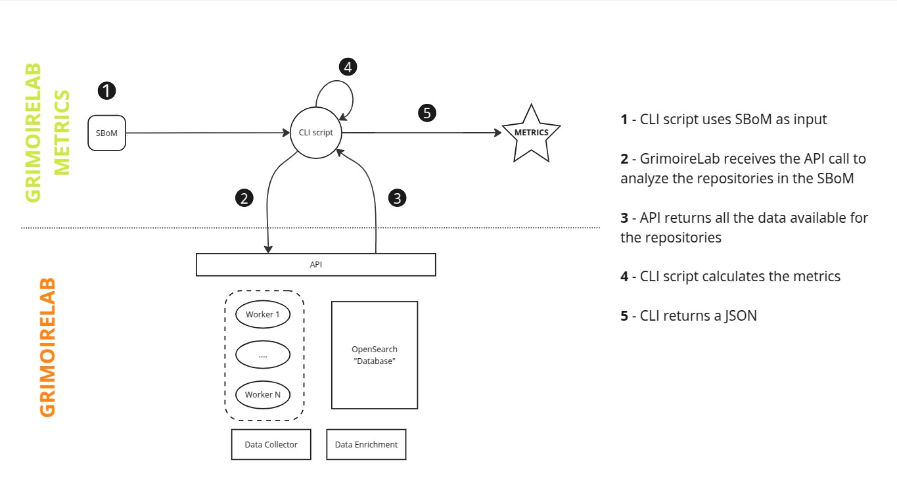

# grimoirelab-metrics

Client to generate GrimoireLab metrics for Project Health using the
software analytics platform [GrimoireLab](https://github.com/chaoss/grimoirelab).



## Installation

### Prerequisites

Instances of GrimoireLab 2.x and OpenSearch must be running before launching this tool.
Please check the [GrimoireLab](https://github.com/chaoss/grimoirelab/blob/2.x/README.md)
documentation in order to deploy the platform.

To get this tool running, we also recommend using [poetry](https://python-poetry.org/).
This package manager will install the tool and all its dependencies.
You can install `poetry` by following [this guide](https://python-poetry.org/docs/#installing-with-pipx).

Once you have `poetry` running, move to the next section.

### Steps

1. Clone the repository:

    ```bash
    git clone git@github.com:Bitergia/grimoirelab-metrics.git
    cd grimoirelab_metrics
    ```

2. Install dependencies and tool:

    ```bash
    poetry update
    poetry install
    ```

    This will install the tool inside of a virtual environment managed by
    poetry. To use the tool you will have to activate it first with the
    command `eval $(poetry env activate)` (poetry >= 2.x) or
    `poetry shell` (poetry < 2.x).

    For development mode, install the tool with: `poetry install --with dev`

## Usage

Given a SPDX SBOM file with git repositories as input, this tool will generate
a set of Project Health metrics. These metrics are calculated using the data
stored on GrimoireLab about those repositories. If any of the repositories
is not available on GrimoireLab, the tool will add it to GrimoireLab to have
it analyzed.

```bash
grimoirelab-metrics spdx.xml \
  --grimoirelab-url http://localhost:8000 \
  --grimoirelab-user user --grimoirelab-password password \
  --opensearch-url https://127.0.0.1:9200 \
  --opensearch-index events \
  --opensearch-user 'admin' --opensearch-password 'admin' \
  --verify-certs --opensearch-ca-certs /path/to/ca.pem \
  --from-date 2024-01-01 --to-date 2025-01-01 \
  --repository-timeout 3600 \
  --code-file-pattern "\.py$|\.js$" \
  --binary-file-pattern "\.exe$|\.tar$" \
  --pony-threshold 0.5 \
  --elephant-threshold 0.5 \
  --dev-categories-thresholds 0.8 0.95 \
  --grimoirelab-ecosystem "npm-training-set"  \
  --grimoirelab-project "npm-popular-components" \
  --output metrics.json
```

The parameters needed to run the tool are:

- A valid SPDX file
- GrimoireLab instance address
- OpenSearch instance address
- OpenSearch index name, where GrimoireLab events data are stored
- Output filename, where metrics will be written.

This is an example of a valid SPDX file:

```xml
<?xml version="1.0" encoding="utf-8"?>
<Document>
    <SPDXID>SPDXRef-DOCUMENT</SPDXID>
    <creationInfo>
        <created>2025-02-07T00:00:01Z</created>
        <creators>Organization: Bitergia</creators>
    </creationInfo>
    <dataLicense>CC0-1.0</dataLicense>
    <name>GrimoireLab</name>
    <spdxVersion>SPDX-2.3</spdxVersion>
    <documentNamespace>mynamespace</documentNamespace>
    <packages>
        <SPDXID>SPDXRef-bootstrap-gnu-config.bst-0</SPDXID>
        <comment>Product: gnu-config</comment>
        <downloadLocation>https://github.com/chaoss/grimoirelab-perceval.git</downloadLocation>
        <filesAnalyzed>false</filesAnalyzed>
        <name>bootstrap/gnu-config.bst</name>
        <sourceInfo>git</sourceInfo>
    </packages>
    <packages>
        <SPDXID>SPDXRef-bootstrap-gnu-config.bst-0</SPDXID>
        <comment>Product: gnu-config</comment>
        <downloadLocation>https://github.com/chaoss/grimoirelab-core.git</downloadLocation>
        <filesAnalyzed>false</filesAnalyzed>
        <name>bootstrap/gnu-config.bst</name>
        <sourceInfo>git</sourceInfo>
    </packages>
</Document>
```

### Running with Docker
The tool can also be run using the published Docker image. This is useful when you
do not want to install Poetry and the tool's dependencies locally.

Build the Docker image from the repository:
```bash
docker build -t healthycode .
```

Then run the tool with a Git repository as the input:

```bash
docker run --rm \
  healthycode \
   /opt/healthycode/.venv/bin/grimoirelab-metrics https://github.com/aboutcode/example.git \
  --grimoirelab-url http://localhost:8000 \
  --grimoirelab-user user --grimoirelab-password password \
  --opensearch-url https://127.0.0.1:9200 \
  --opensearch-index events \
  --opensearch-user 'admin' --opensearch-password 'admin' \
  --verify-certs --opensearch-ca-certs /path/to/ca.pem \
  --from-date 2024-01-01 --to-date 2025-01-01 \
  --repository-timeout 3600 \
  --code-file-pattern "\.py$|\.js$" \
  --binary-file-pattern "\.exe$|\.tar$" \
  --pony-threshold 0.5 \
  --elephant-threshold 0.5 \
  --dev-categories-thresholds 0.8 0.95 \
  --grimoirelab-ecosystem "npm-training-set"  \
  --grimoirelab-project "npm-popular-components" \
  --output metrics.json
```
