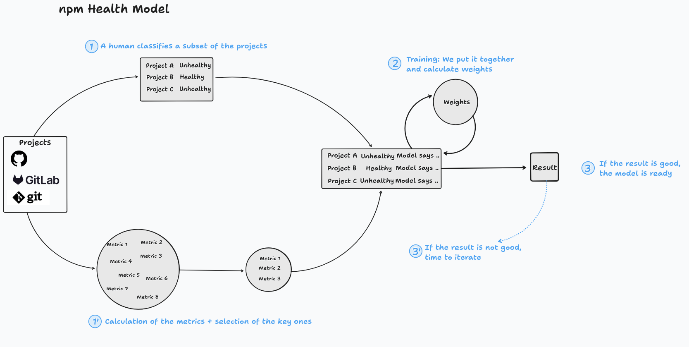

# npm Health Model

The idea behind this model is to predict based on data obtained from GrimoireLab if a
project is adding risks to organizations that are consuming it.

This is what you will find in this directory:
 - `data/`: The data used to train and test the model is available under. The data was
 collected on 2026-06-19
 - `notebooks/`: Jupyter notebooks to compute the model based on the data
 - `docs/`: A description of the process to allow future improvements

 ## A brief description of the process

  

  These are the main steps we followed to build the model:
   - 1) We selected a small set of projects. An expert evaluated them as either 
   healthy or unhealthy.
   - 1) (1') In parallel, we calculated a bunch of metrics with GrimoireLab. Not 
   all the metrics were relevant and some of them were redundant, so we selected
   the ones that added the most value.
   - 2) We put everything together—the metrics and the evaluation of the expert—and 
   trained the model. The result of the training was an equation with weights 
   for each of the metrics.
   - 3) The accuracy of the model was tested. If it looked bad, it was time to 
   iterate; if it was good enough, we were done.